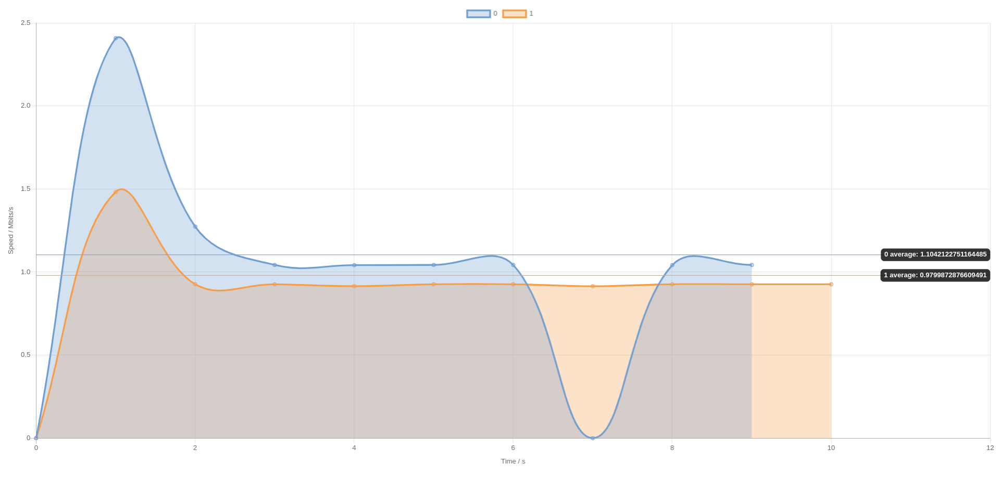

# vue-iperf3-chart

[](https://www.npmjs.com/package/vue-iperf3-chart)
[](https://www.npmjs.com/package/vue-iperf3-chart)
[](https://github.com/DCsunset/vue-iperf3-chart/blob/master/LICENSE)

A Vue component to plot iperf3 json data.

## Install

```
npm install vue-iperf3-chart
```

## Usage

First import the package and **css**,
and then use it as a Vue Component:

```html
<template>
	<div style="height: 95vh">
		<chart :data="jsonData" :options="options" />
	</div>
</template>

<script>
import jsonData from "./data.json";
import Chart from "vue-iperf3-chart";
import "vue-iperf3-chart/dist/vue-iperf3-chart.css";

export default {
	name: "app",
	components: {
		Chart
	},
	data() {
		return {
			jsonData,
			options: {
				maintainAspectRatio: false
			}
		};
	}
};
</script>
```

The iperf3 chart's height and width depend on its parent node.
When the size of its parent node changes,
it changes as well.

The chart's data is also responsive.
When the data changes,
the chart will be refreshed.

## Props

| Prop        | Type   | Default                     | Description                                                                                                                       |
| ----------- | ------ | --------------------------- | --------------------------------------------------------------------------------------------------------------------------------- |
| data        | Array  | `undefined`                 | An array of iperf3 json data                                                                                                      |
| options     | Object | `undefined`                 | options passed to Chart.js                                                                                                        |
| unit        | String | `"Mbits"`                   | The unit can be `"Kbits"`, `"Mbits"` or `"Gbits"`                                                                                 |
| start       | Number | `0`                         | The starting interval in data                                                                                                     |
| end         | Number | `-1`                        | The ending interval in data (-1 means the end)                                                                                    |
| fillAlpha   | Number | `0.5`                       | The background alpha channel of each line                                                                                         |
| colorScheme | String | `"tableau.ClassicMedium10"` | The color scheme used in `chartjs-plugin-colorschemes`. It can be picked at <https://nagix.github.io/chartjs-plugin-colorschemes> |


## Events

| Event  | Argument    | Description                                  |
| ------ | ----------- | -------------------------------------------- |
| parsed | Parsed data | When data changes, the event will be emitted |


## Test

First clone this repository and install dependencies:

```
npm install
```

Then start the dev server to plot

```
npm run serve
```

Put the json data file in `src/data.json`.

Then change the options of Chart.js in `App.vue`
to have custom settings.


## Screenshot



## License

MIT License

